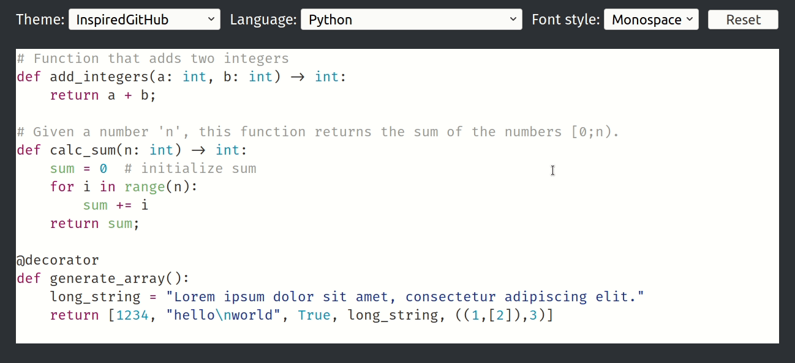

# edix-1: Mixing Fonts

[](https://github.com/fkohlgrueber/edix-1)
[](https://github.com/fkohlgrueber/terminal-editor-rs/blob/master/LICENSE-APACHE)
[](https://github.com/fkohlgrueber/terminal-editor-rs/blob/master/LICENSE-MIT)

*This project is the first part of a series of editor experiments (edix) in which I'll be exploring alternative code editing UX.*

## About

Monospace fonts are the de-facto standard for editing code. While proportional fonts have been used for documents and websites for decades, terminals and text editors intended for programming have largely remained to use monospace fonts. 

Of course, the choice of a font is a matter of taste and there won't be a single "right" one. What works for me might not work for others, and that's ok. Arguing with taste is difficult because it can easily lead to ["holy war"](https://en.wikipedia.org/wiki/Editor_war) like discussions. That being said, it seems like there are widely accepted arguments regarding proportional and monospace fonts for programming. Detailed discussions on monospace vs. proportional fonts for programming can easily be found on the internet, for example [here](https://stackoverflow.com/a/218749/3594526) and [here](https://softwareengineering.stackexchange.com/questions/5473/does-anyone-prefer-proportional-fonts). I won't reiterate all of these arguments, but instead focus on two major ones.

For general-purpose texts (documents, UI, websites, ...), most people prefer using proportional fonts. Different widths of characters make scanning words and finding typos in them easier. Compared to monospace fonts, proportional fonts also usually have a higher density, so you can fit more words on a line. On the other hand, some punctuation characters ("()[];,.") are very narrow in proportional fonts. These characters play a more important role in programming languages than in general text. Punctuation characters are often larger in monospace fonts than in proportional fonts and therefore easier to read and distinguish.

Given the two arguments above, which font should be used for programming? For things like comments, strings and identifiers, a proportional font would make more sense, but this would make punctuation characters less readable. A monospace font is a good fit for punctuation characters, but not as good for displaying comments etc.. Choosing a single font for programming therefore is a trade-off between the readability of different parts of source code. Most people choose monospace fonts and live with comments being slightly less readable, some choose proportional fonts and try to get used to the dense punctuation characters. Neither approach is optimal.

But what if you didn't have to choose a single font? what if you could use different fonts for different parts of your source code? Writing a comment would automatically change to a proportional font, while whitespace and punctuation characters would use a monospace font. This experiment explores this idea.

## The experiment

[](https://raw.githubusercontent.com/fkohlgrueber/edix-1/master/doc/demo.gif)

**[Live demo](https://fkohlgrueber.github.io/edix-1/)**

The experiment consists of a text editing area and a settings panel. The settings panel can be used to set a color theme, a syntax and a font style. The color theme and syntax options are regular syntax highlighting options and the font style option is where it gets interesting.

The experiment supports three font styles: "Monospace", "Sans" and "Mixed". The "Monospace" and "Sans" options render the whole source code using [Fira Code](https://github.com/tonsky/FiraCode) (Monospace) and [Fira Sans](https://github.com/mozilla/Fira) (Sans) respectively. The "Mixed" option uses both fonts, where each token in the source code is rendered depending on the token type. The current implementation is pretty simple and uses sans-serif for comments, strings and identifiers and monospace otherwise. While it works surprisingly well for different languages, there may be differences (e.g. identifiers may or may not be rendered as sans-serif) depending on the selected language. 

The source text area can be edited. You can write functions, comment lines, etc. just like in a regular text editor. In the "Mixed" font sytle mode, the font type will change while editing. Try writing the keyword "return" character by character. Up to "retur", it is an identifier and rendered in sans-serif. Appending an "n" makes it a keyword which is rendered in monospace. Another interesting editing operation is commenting lines / blocks which also changes the font.

### Implementation

The experiment is written in [Rust](https://www.rust-lang.org/). It uses the [Yew web framework](https://yew.rs/) and [syntect](https://github.com/trishume/syntect) for syntax highlighting. Syntect assigns [scopes](https://www.sublimetext.com/docs/3/scope_naming.html) to each token in the source code. These scopes are used to decide which font to use for rendering.

The text editor is custom-made and doesn't use standard html input elements. This allows total control over cursor movement and rendering, which will be required in later experiments. I tried to keep the implementation simple, so some basic editing operations are missing. There are no selections and no support for cut/copy/paste. Basic editing (simple cursor movement, text input and removal) is implemented though.

### Build

Make sure to have [Rust](https://www.rust-lang.org/) and [wasm-pack](https://github.com/rustwasm/wasm-pack) installed. Then run the following commands from the project folder:

```
wasm-pack build --target web
rollup ./main.js --format iife --file ./pkg/bundle.js
```

You can locally host the experiment, e.g. by using Python's simple http server:

```
python3 -m http.server
```

## Impressions

This section contains my personal impressions from using the experiment. You may disagree with some of the points below, and that's perfectly fine.

- Comments in sans-serif are more compact and still more readable than in monospace.
- Whitespace and punctuation characters are more readable in monospace.
- Fonts changing during typing doesn't bother me. It can cause the cursor to jump horizontally, but I didn't find this to be irritating.
- I'm not sure whether I prefer identifiers in monospace or in sans-serif. For longer identifiers, sans-serif is easier to read, but single character identifiers ("i", "x", ...) are tiny and I prefer monospace for those.
- I like that Font ligatures are only used in the source code and not in comments / strings. For example, the two characters `->` are displayed as a pretty arrow when used as a type annotation in Python, while the string `"->"` wouldn't use the ligature. Different fonts can prevent ligatures from being used where they shouldn't be used.
- Using mixed fonts, just like different fonts or syntax themes, won't make you a 10x developer. I can imagine that it might cause a minimal productivity increase, but don't expect too much. For me, the largest motivation is simply aesthetics. I'm spending a lot of time looking at code and so therefore want it to look good.

## Next steps

So what's next? While I believe that `edix-1`'s mixed font rendering is an improvement over traditional code editors, there are a few other ideas I'd like to pursue in future `edix-X`s. The following list contains a couple of ideas. Some of these might be implemented on top of `edix-1`, others as independant projects.

- *Alignment*: Alignment is often seen as an advantage of monospace text, which naturally renders as a grid with aligned columns. When using non-proportional fonts, one has to explicitly handle alignment. One possiblility would be [Elastic tabstops](http://nickgravgaard.com/elastic-tabstops/), possibly integrated with language-specific pretty-printers.
- *Line-wrapping*: wrapping lines that don't fit into the current viewport is standard in WYSIWYG-Editors and the web, but programmers still manually handle line breaks when writing code. Especially for documentation, I find this pretty annoying. A future `edix-X` version could provide line-wrapping for source code that respects indentation. You could roughly think of this as a pretty-printer set to the current editor width running after each key press.
- *Separation*: Source code is stored and edited using the same representation (a character sequence containing human-readable syntax). Storage and editing have different (and sometimes conflicting) requirements, and I believe that using different representations for them would have positive effects in various areas (evolution / personalization of syntax, compatibility of stored code, ...).
- *Non-text elements*: This is a far stretch, but being able to put diagrams in documentation comments or math formulas in source code could be interesting too. 
- ...

## Summary

This was `edix-1`, the first (and hopefully not last) experiment in this series. I hope you enjoyed playing with it and reading through this page. What do you think? Would you like to use a mixed-font code editor? Do you agree that proportional fonts should have their place in source code files? I'd be interested in hearing your thoughts, so please feel free to send an [e-mail](mailto:felix.kohlgrueber+blog@gmail.com) or comment **TODO: where to comment**.

If don't want to miss updates and future prototypes, you can subscribe to my [blog](https://fkohlgrueber.github.io/) or follow me on [twitter](https://twitter.com/FKohlgrueber).

I'm looking forward to interesting conversations, thanks in advance 😉
